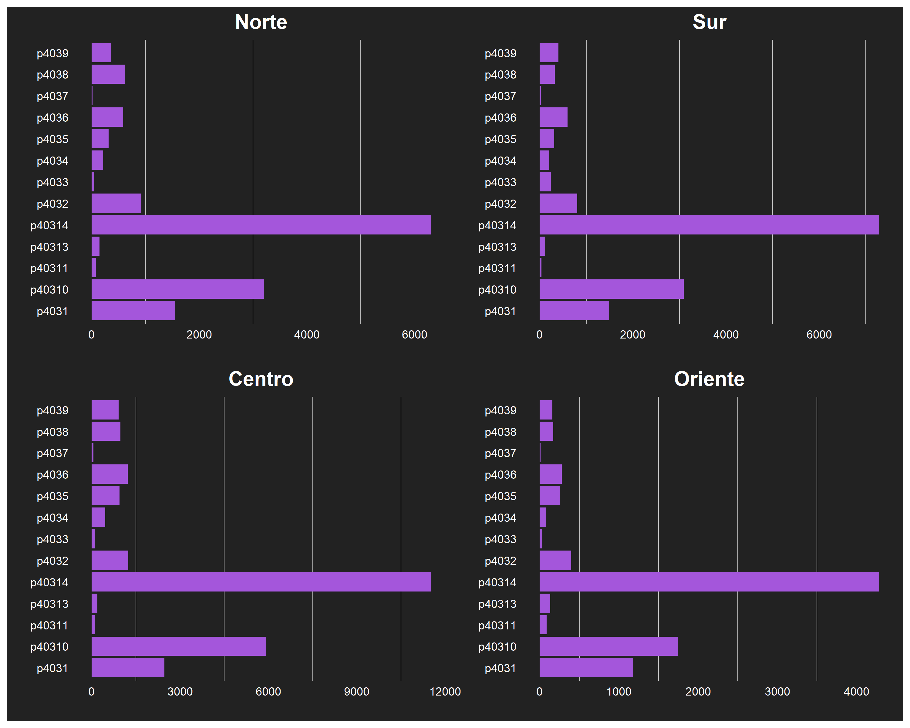

## Sobre mi

Bachiller de la UNMSM de la carrera de Matemática ocupando el 5to superior.

Me he especializado con cursos de Machine Learning, Data Science, Analytics, entre otros. Además, cuento con habilidades blandas como comunicación asertiva, trabajo en equipo, manejo de estrés, etc.

## Tecnologías y Herramientas

- Lenguajes
  - Python | R | SQL
- Visualización
  - Power BI
- Otros
  - Quarto | Git

## Educación

- Universidad Nacional Mayor de San Marcos (2013 - 2022)

  - Matemática pura - Facultad de Ciencias Matemáticas

- Escuela Nacional de Estadística e Informática (2024)

  - Programa de Extensión Universitaria Ciencia del Dato – INEI

## Proyectos

### [¿A dónde va un peruano cuando se enferma?](https://alexanderpereda.github.io/enaho-23-400-salud/main.html)

Se realizó un análisis exploratorio de datos (EDA) para encontrar un patrón en la conducta del peruano ante un malestar o enfermedad.
Se utilizo como datos primarios la Encuesta Nacional de Hogares 2023 (Enaho).

### [Classification of cell phones according to price](https://github.com/AlexanderPereda/Alexander-Pereda-Projects/blob/main/Cell%20phone%20price%20ranking%20with%20SVM.ipynb)

Se desarrolló un clasificador que categorizara los celulares en 4 clases. Trabajamos los datos con limpieza y exploración, para luego entrenar un modelo de Support Vector Machine, el cual fue optimizado dando un accuracy elevado.

### [Probability of suffering a stroke using Random Forest](https://github.com/AlexanderPereda/Alexander-Pereda-Projects/blob/main/Probability%20of%20suffering%20a%20stroke%20using%20Random%20Forest.ipynb)

Se desarrolló un predictor que nos permitiera saber las probabilidades que una persona sufriera un accidente cerebrovascular. Usando Random Forest, junto a una serie de procesos como ingeniería de variables, obtuvimos un accuracy de 72%.
